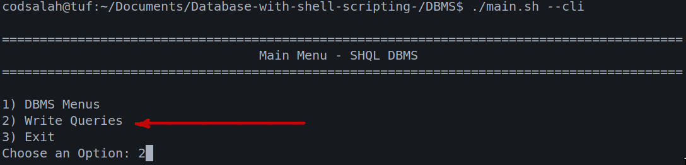
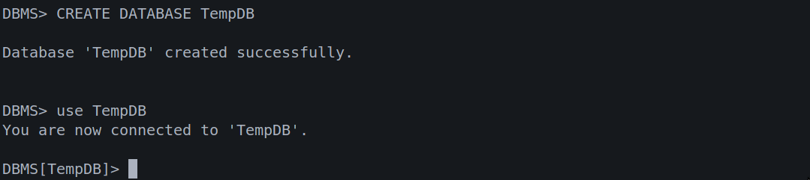
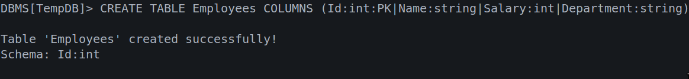
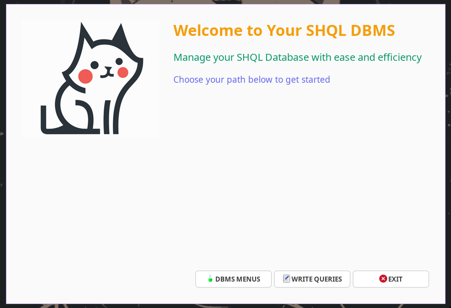
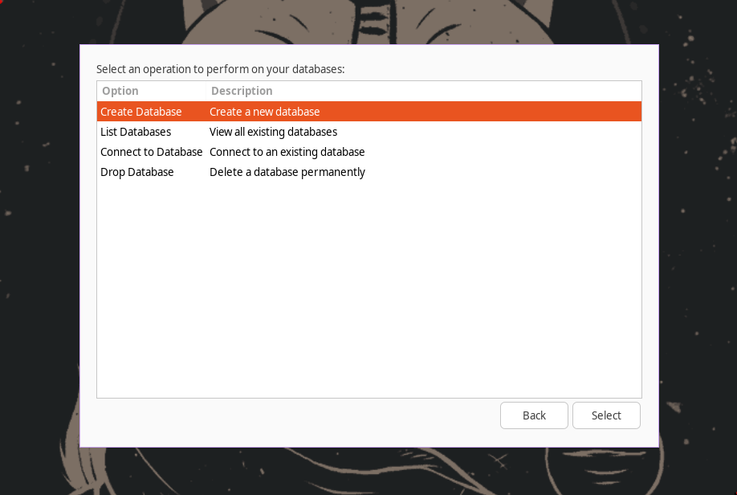
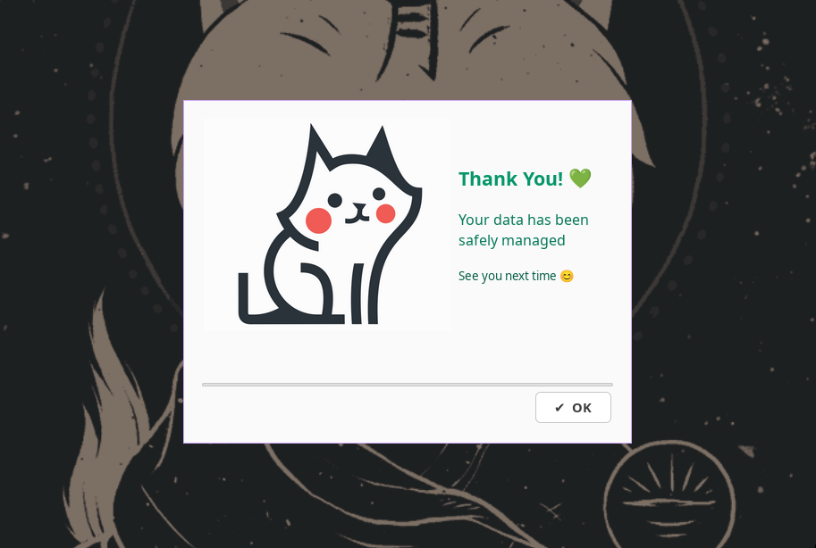
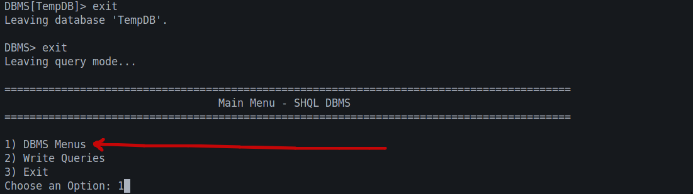
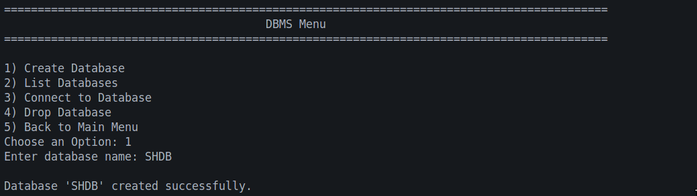
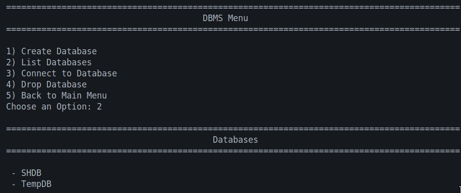

# SHQL DBMS - Shell-Based Database Management System

Welcome to **SHQL DBMS**, a powerful and lightweight Database Management System built entirely using Bash scripting. This project offers a robust solution for managing databases with support for SQL-like queries, a user-friendly Graphical User Interface (GUI), and a classic Command Line Interface (CLI).

<p align="center">
  
</p>

## Features

SHQL DBMS provides three main ways to interact with your data:

1.  **SQL-Like Queries**: A powerful query engine that supports standard database operations using familiar syntax.
2.  **Graphical User Interface (GUI)**: A modern, visually appealing interface built with `yad` for intuitive database management.
3.  **CLI Option Menu**: A text-based menu system for quick and efficient operations directly from the terminal.

---

## Prerequisites

To run this project, ensure you have the following installed on your Linux system:

*   **Bash**: The core scripting language (usually pre-installed).
*   **YAD (Yet Another Dialog)**: Required for the GUI mode.
    ```bash
    sudo apt-get install yad  # Debian/Ubuntu
    sudo dnf install yad      # Fedora
    ```

---

## Installation & Setup

1.  **Clone the repository:**
    ```bash
    git clone https://github.com/codsalah/SHQL-DBMS-Shell-Based-Database-Management-System.git
    cd SHQL-DBMS-Shell-Based-Database-Management-System
    ```

2.  **Navigate to the DBMS directory:**
    ```bash
    cd DBMS
    ```

3.  **Make scripts executable:**
    ```bash
    chmod +x *.sh
    ```
---

## Usage

Start the application using the main entry script `main.sh`. You can choose between CLI and GUI modes.

### 1. CLI Mode (Default)
Run the application in the standard command-line interface:
```bash
./main.sh
# OR explicitly
./main.sh --cli
```
This mode provides a text-based menu to navigate through database operations or enter the query interface.

### 2. GUI Mode
Launch the graphical interface for a more visual experience:
```bash
./main.sh --guii
```
The GUI features a modern design with:
*   **Dashboard**: Central hub for all operations.
*   **Interactive Dialogs**: Easy-to-use forms for creating databases, tables, and inserting data.
*   **Visual Feedback**: Success/Error notifications and confirmation dialogs.


<video controls src="GUI_demo.mp4" title="Title"></video>

---

## Functionalities Detail

### 1. SQL Query Interface
The Query interface allows you to execute SQL-like commands. It supports a wide range of operations including:

---
#### 1.1. **Query Interface**
<p align="center">
  
</p>

<p align="center">
  
</p>

<p align="center">
  
</p>


#### 1.2. **Supported Commands**

* **DDL (Data Definition Language)**:

  * `CREATE DATABASE <name>`
  * `DROP DATABASE <name>`
  * `CREATE TABLE <name> COLUMNS (col1:type:pk|col2:type| ...)`
  * `DROP TABLE <name>`
  * `TRUNCATE TABLE <name>`

* **DML (Data Manipulation Language)**:

  * `INSERT INTO <table> VALUES (...)`
  * `UPDATE <table> SET <col>=<val> WHERE <condition>`
  * `DELETE FROM <table> WHERE <condition>`
  * `SELECT ALL FROM <table>`
  * `SELECT <cols> FROM <table> WHERE <condition>`

* **Database & Table Navigation**:

  * `USE <database>`
  * `LIST DATABASES`
  * `SHOW DATABASES`
  * `LIST TABLES`

* **Search / Sorting Utilities**:

  * `SEARCH <table> WHERE <PK>=<value>`
  * `SORT <table> BY <PK>`

---

> **Note:** For a complete list of supported commands and syntax, please refer to the [SQL_REFERENCE.md](SQL_REFERENCE.md) file.

### 2. GUI Interface
The GUI mode simplifies complex tasks with point-and-click interactions:
*   **Manage Databases**: Create, list, connect, and drop databases with a single click.
*   **Table Operations**: Visually create tables, define columns, and manage data.
*   **Data Entry**: User-friendly forms for inserting and updating records without memorizing syntax.

<p align="center">
  
</p>

<p align="center">
  
</p>

<p align="center">
  
</p>

> **Note:** Clone the project to explore and test all GUI functionalities

### 3. CLI Option Menu
The CLI menu offers a structured way to manage your databases without graphical overhead:
*   **Step-by-Step Navigation**: Clear menu options guide you through every process.
*   **Efficiency**: Fast execution for users comfortable with the terminal.

<p align="center">
  
</p>

<p align="center">
  
</p>

<p align="center">
  
</p>

> **Note:** Clone the project to explore and test all GUI functionalities

---

## Project Structure

*   `DBMS/`: Contains all the source scripts.
    *   `main.sh`: The entry point of the application.
    *   `queries.sh`: The core engine for parsing and executing SQL commands.
    *   `DBMS_menu.sh`: Handles the menu logic for both CLI and GUI.
    *   `yad_utilities.sh`: Helper functions for the GUI interface.
    *   `create_db.sh`, `create_tb.sh`, etc.: Individual scripts for specific operations.
*   `Databases/`: The storage directory where your databases and tables are saved.
*   `SQL_REFERENCE.md`: Detailed documentation of the supported SQL syntax.

---

## Contributing

Contributions are welcome! Feel free to submit issues or pull requests to improve the functionality or add new features.

### Contributors

*   [Mahmoud Shaker Github](https://github.com/MahmoudShaker15) | [LinkedIn](https://www.linkedin.com/in/mahmoud-shaker-el-rifai/)
*   [Salah Algamasy Github](https://github.com/codsalah) | [LinkedIn](https://www.linkedin.com/in/salah-algamasy/)

---

**Enjoy managing your data with SHQL DBMS! ✨**

